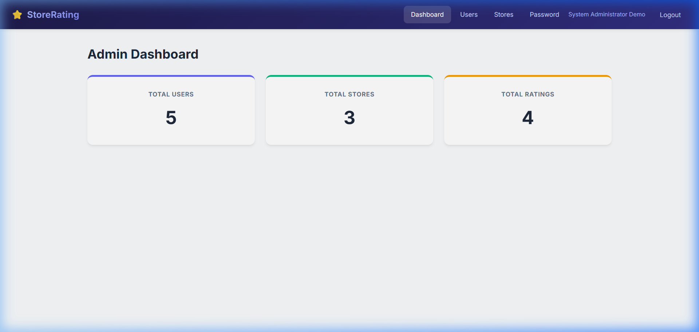
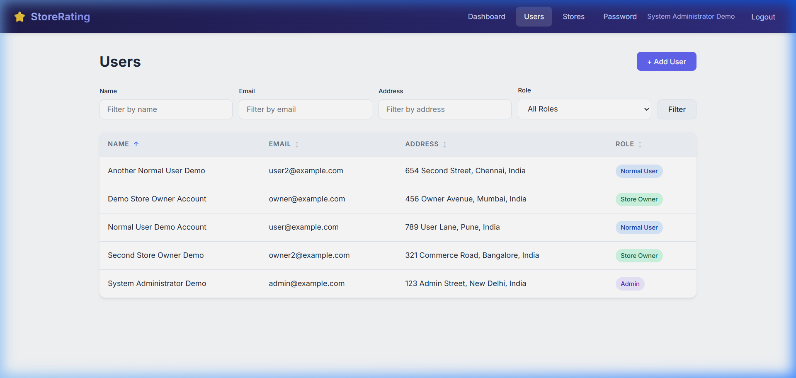
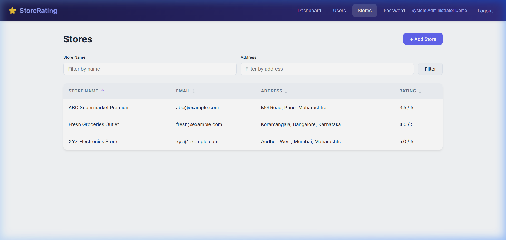
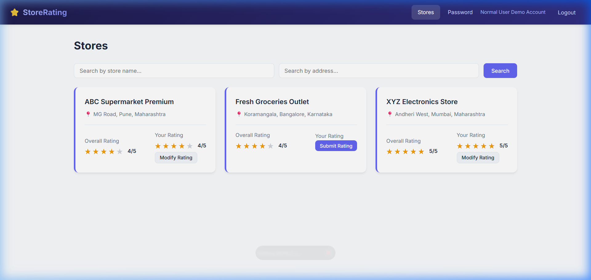
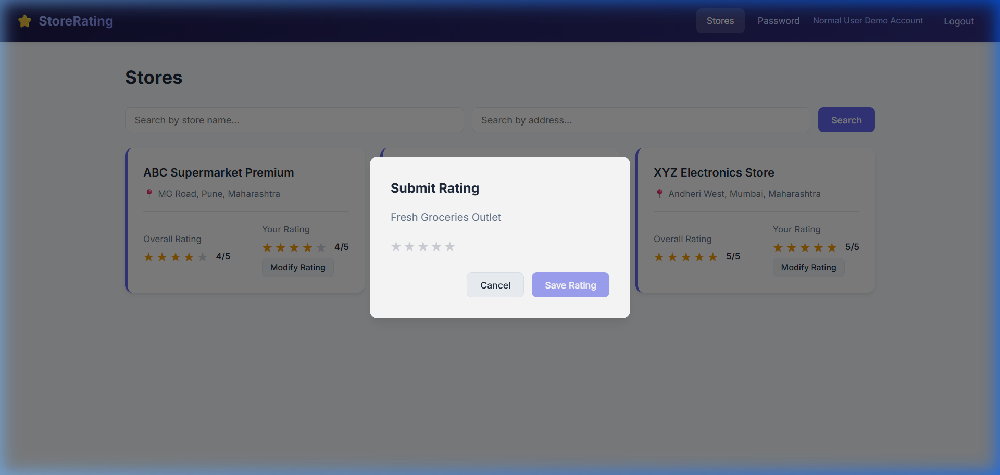
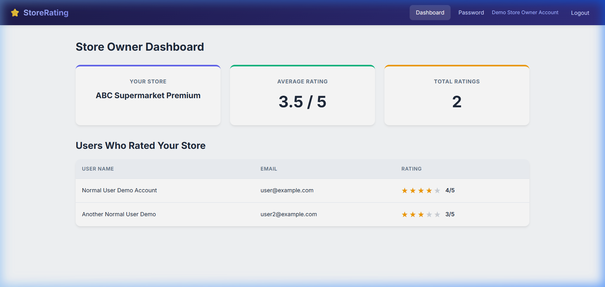
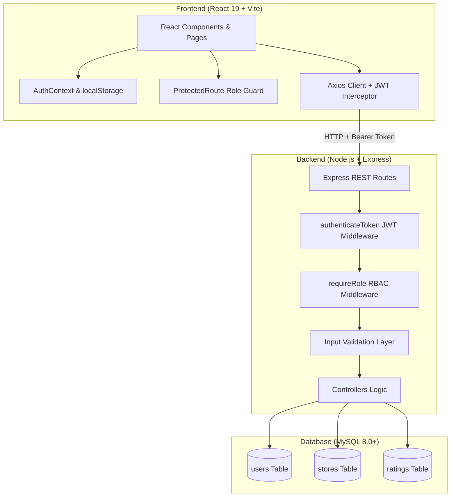
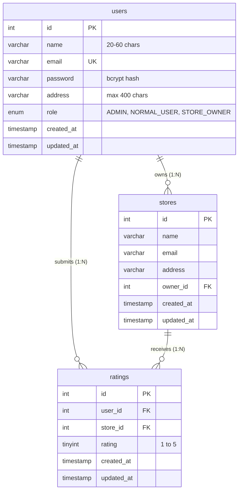

# ⭐ StoreRating — Full-Stack Store Rating Application

[](https://nodejs.org/)
[](https://expressjs.com/)
[](https://reactjs.org/)
[](https://vitejs.dev/)
[](https://www.mysql.com/)
[](https://jwt.io/)

A complete, production-quality, interview-friendly full-stack web application for an **Intern Coding Challenge**. The platform allows normal users to submit and modify ratings (1 to 5 stars) for registered stores, store owners to analyze their store ratings and customer feedback, and system administrators to oversee users, stores, and platform analytics.

---

## 🎬 Live Animated Demo

Here is a full end-to-end interactive preview showing authentication, role-based redirection, admin management, normal user rating submission/modification, and store owner analytics:


---

## 📸 Screenshots & UI Showcase

### 1. Unified Authentication System
Single login system with automatic role detection and redirect (`ADMIN` → Admin Dashboard, `NORMAL_USER` → Stores, `STORE_OWNER` → Owner Dashboard).

| Login Screen | Normal User Self-Registration |
| :---: | :---: |
|  | Name (20–60 chars), valid email, strong password (8–16 chars, uppercase & special char) |

---

### 2. System Administrator Experience
Real-time dashboard analytics aggregated directly from MySQL via SQL queries. Complete user and store management with dynamic filtering and clickable ascending/descending sorting.

| Admin Analytics Dashboard | Admin User Directory & Filters |
| :---: | :---: |
|  |  |

| Admin Stores Management | User Details with Store Owner Rating |
| :---: | :---: |
|  | Displays overall store average rating when viewing a Store Owner |

---

### 3. Normal User Store Directory & Rating Flow
Stores are displayed with average ratings and the authenticated user's submitted rating. Users can search by name and address, submit a new rating (1–5), or modify an existing rating without creating duplicate rows.

| Store Listing & Search | Interactive Star Rating Modal |
| :---: | :---: |
|  |  |

---

### 4. Store Owner Analytics Dashboard
Store owners have access strictly to their own store metrics via server-enforced JWT identity (cannot access other owners' data). Shows average star rating and a breakdown of customer ratings.



---

## 🏗️ System Architecture



---

## 🗄️ Database Schema & Relationships

The database is built following strict relational principles:
- **Foreign keys** ensuring referential integrity (`ON DELETE CASCADE` / `RESTRICT`)
- **CHECK constraints** enforcing data validity (`rating BETWEEN 1 AND 5`, `CHAR_LENGTH(name) >= 20`)
- **UNIQUE constraints** preventing duplicate ratings (`UNIQUE(user_id, store_id)`)
- **Indexes** optimizing search queries on `email`, `role`, `name`, and foreign keys.



---

## 🚀 Getting Started

### Prerequisites
- [Node.js](https://nodejs.org/) (v18 or higher)
- [MySQL](https://www.mysql.com/) (v8.0 or higher)

---

### 1. Database Setup
Log into your MySQL client and initialize the database schema:

```bash
# From the project root directory:
mysql -u root -p < database/schema.sql
```

---

### 2. Backend Configuration & Setup

```bash
cd backend
npm install
```

Create a `.env` file in the `backend/` directory (or copy from `.env.example`):

```env
PORT=5000
DB_HOST=localhost
DB_PORT=3306
DB_NAME=store_rating
DB_USER=root
DB_PASSWORD=your_mysql_password
JWT_SECRET=your_jwt_secret_key_here
```

Seed the database with development accounts and initial stores:
```bash
npm run seed
```

Start the backend API server:
```bash
npm run dev
```
> The API will be available at: **`http://localhost:5000`**

---

### 3. Frontend Setup

```bash
cd ../frontend
npm install
npm run dev
```
> The client app will be running at: **`http://localhost:5173`**

---

## 🔑 Demo Credentials

> ⚠️ *These credentials are created by the seed script for development and evaluation purposes.*

| Role | Email | Password | Allowed Access |
| :--- | :--- | :--- | :--- |
| **System Administrator** | `admin@example.com` | `Admin@123` | Full dashboard, User & Store CRUD, Filters, Sorting |
| **Store Owner** | `owner@example.com` | `Owner@123` | Store analytics, View users who rated their store |
| **Normal User** | `user@example.com` | `User@123` | View store directory, Search, Rate stores (1–5), Edit rating |

---

## 📡 REST API Reference

### 🔐 Authentication
| Method | Endpoint | Access | Description |
| :--- | :--- | :--- | :--- |
| `POST` | `/api/auth/register` | Public | Register a new normal user |
| `POST` | `/api/auth/login` | Public | Authenticate user & return JWT + role |
| `POST` | `/api/auth/change-password` | Authenticated | Change current user password |

### 👥 Users Management
| Method | Endpoint | Access | Description |
| :--- | :--- | :--- | :--- |
| `GET` | `/api/users` | `ADMIN` | List all users (with filters: `name`, `email`, `address`, `role` & `sortBy`, `order`) |
| `GET` | `/api/users/:id` | `ADMIN` | User details (includes store rating if `STORE_OWNER`) |
| `POST` | `/api/users` | `ADMIN` | Create user with specified role |

### 🏪 Stores Management
| Method | Endpoint | Access | Description |
| :--- | :--- | :--- | :--- |
| `GET` | `/api/stores` | Authenticated | List stores (search by `name`, `address` + includes `userRating` for normal users) |
| `GET` | `/api/stores/:id` | Authenticated | Get single store details |
| `POST` | `/api/stores` | `ADMIN` | Create new store and assign to a store owner |
| `GET` | `/api/stores/owners` | `ADMIN` | Retrieve list of eligible store owner users |

### ⭐ Ratings
| Method | Endpoint | Access | Description |
| :--- | :--- | :--- | :--- |
| `POST` | `/api/stores/:storeId/ratings` | `NORMAL_USER` | Submit rating (1–5) for a store |
| `PUT` | `/api/stores/:storeId/ratings` | `NORMAL_USER` | Modify existing rating |
| `GET` | `/api/stores/:storeId/ratings` | Authenticated | View rating list for a store |

### 📊 Dashboards
| Method | Endpoint | Access | Description |
| :--- | :--- | :--- | :--- |
| `GET` | `/api/admin/dashboard` | `ADMIN` | Total users, stores, and ratings counts |
| `GET` | `/api/owner/dashboard` | `STORE_OWNER` | Current store metrics and average rating |
| `GET` | `/api/owner/ratings` | `STORE_OWNER` | List of customers who rated the store |


---

## 📁 Repository Structure

```
store-rating-app/
├── backend/
│   ├── src/
│   │   ├── config/
│   │   │   └── db.js              # MySQL connection pool
│   │   ├── controllers/
│   │   │   ├── adminController.js  # Dashboard aggregations
│   │   │   ├── authController.js   # Login, Register, Password
│   │   │   ├── ownerController.js  # Owner dashboard & ratings
│   │   │   ├── ratingController.js # Rating submit & modify
│   │   │   ├── storeController.js  # Store CRUD & search
│   │   │   └── userController.js   # User CRUD, filters, sorting
│   │   ├── middleware/
│   │   │   └── authMiddleware.js   # JWT authentication & RBAC
│   │   ├── routes/
│   │   │   ├── adminRoutes.js
│   │   │   ├── authRoutes.js
│   │   │   ├── ownerRoutes.js
│   │   │   ├── ratingRoutes.js
│   │   │   ├── storeRoutes.js
│   │   │   └── userRoutes.js
│   │   ├── validators/
│   │   │   └── validation.js       # Shared validation logic
│   │   ├── app.js                  # Express middleware setup
│   │   ├── seed.js                 # Database seeder script
│   │   └── server.js               # Entry point
│   ├── .env.example
│   └── package.json
├── frontend/
│   ├── src/
│   │   ├── components/
│   │   │   ├── DataTable.jsx       # Reusable sortable table
│   │   │   ├── Navbar.jsx          # Role-aware top navigation
│   │   │   ├── ProtectedRoute.jsx  # Route protection guard
│   │   │   ├── RatingInput.jsx     # Star rating selector (1-5)
│   │   │   └── StoreCard.jsx       # Store card component
│   │   ├── context/
│   │   │   └── AuthContext.jsx     # User auth state provider
│   │   ├── pages/
│   │   │   ├── AdminAddStore.jsx
│   │   │   ├── AdminAddUser.jsx
│   │   │   ├── AdminDashboard.jsx
│   │   │   ├── AdminStores.jsx
│   │   │   ├── AdminUserDetail.jsx
│   │   │   ├── AdminUsers.jsx
│   │   │   ├── ChangePassword.jsx
│   │   │   ├── Login.jsx
│   │   │   ├── OwnerDashboard.jsx
│   │   │   ├── Register.jsx
│   │   │   └── UserStores.jsx
│   │   ├── services/
│   │   │   └── api.js              # Axios with JWT bearer interceptor
│   │   ├── App.jsx                 # Route configurations
│   │   ├── index.css               # Professional custom styling
│   │   └── main.jsx
│   ├── index.html
│   └── package.json
├── database/
│   ├── schema.sql                  # MySQL schema definition
│   └── seed.sql                    # Initial seed data
├── screenshots/                    # Screenshots & demo animation
│   ├── 01_login.png
│   ├── 02_admin_dashboard.png
│   ├── 03_admin_users.png
│   ├── 04_admin_stores.png
│   ├── 05_user_stores.png
│   ├── 06_rating_modal.png
│   ├── 07_owner_dashboard.png
│   └── demo_walkthrough.webp       # Animated live preview
├── .gitignore
└── README.md
```

---

## 👨‍💻 Author

**Prathmesh Chopade**
- GitHub: [@Prathmesh00796](https://github.com/Prathmesh00796)
- Email: prathmeshchopade96@gmail.com
